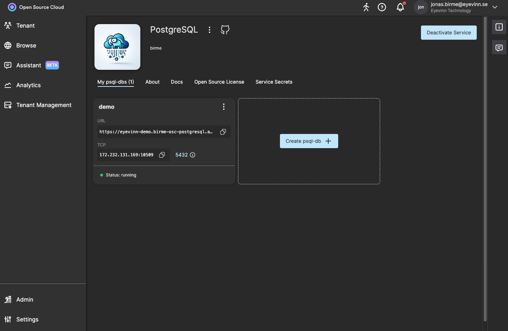

# Postgresql OSC image

This is an extension to the [PostgreSQL community maintained docker image](https://github.com/docker-library/postgres) to enable it in Eyevinn Open Source Cloud.

[](https://app.osaas.io/browse/birme-osc-postgresql)

## What is PostgreSQL

PostgreSQL, often simply "Postgres", is an object-relational database management system (ORDBMS) with an emphasis on extensibility and standards-compliance. As a database server, its primary function is to store data, securely and supporting best practices, and retrieve it later, as requested by other software applications, be it those on the same computer or those running on another computer across a network (including the Internet). It can handle workloads ranging from small single-machine applications to large Internet-facing applications with many concurrent users. Recent versions also provide replication of the database itself for security and scalability.

PostgreSQL implements the majority of the SQL:2011 standard, is ACID-compliant and transactional (including most DDL statements) avoiding locking issues using multiversion concurrency control (MVCC), provides immunity to dirty reads and full serializability; handles complex SQL queries using many indexing methods that are not available in other databases; has updateable views and materialized views, triggers, foreign keys; supports functions and stored procedures, and other expandability, and has a large number of extensions written by third parties. In addition to the possibility of working with the major proprietary and open source databases, PostgreSQL supports migration from them, by its extensive standard SQL support and available migration tools. And if proprietary extensions had been used, by its extensibility that can emulate many through some built-in and third-party open source compatibility extensions, such as for Oracle.


## Usage

Launch a PostgreSQL database in Eyevinn Open Source Cloud

Install the OSC command line tool:

```
% npm install -g @osaas/cli
```

Given that your postgres password is stored as a service secret in `postgrespwd`.

```
% export OSC_ACCESS_TOKEN=<personal-access-token>
% osc create birme-osc-postgresql demo -o PostgresPassword="{{secrets.postgrespwd}}"
```

Navigate to the [service page](https://app.osaas.io/dashboard/service/birme-osc-postgresql) with the instance cards and obtain the IP and port to your instance.



Test the connection

```
% docker run -it --rm postgres psql -h <IP> -p <PORT> -U postgres
Password for user postgres: 
psql (17.0 (Debian 17.0-1.pgdg120+1))
Type "help" for help.

postgres=# 
```
